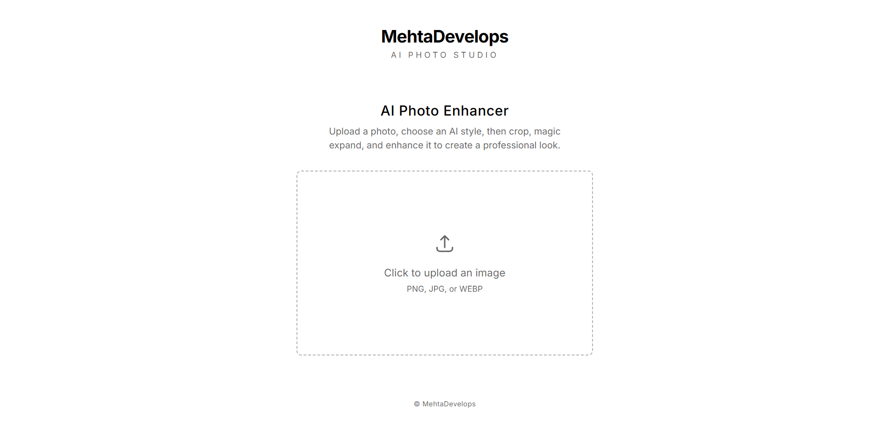

 
<h1>MehtaDevelops – AI Image Editor</h3>

MehtaDevelops introduces a next-generation AI Image Editor powered by Google’s Nano Banana technology. Built with an emphasis on elegance, speed, and intelligence, the editor delivers a seamless experience while keeping simplicity at its core.

🚀 Why Nano Banana?

Google’s Nano Banana brings the best of lightweight AI with powerful performance. By integrating it, the editor ensures:

⚡ Speed – lightning-fast image understanding and transformation.

🔎 Efficiency – optimized for low compute costs while retaining top quality.

📈 Scalability – a foundation that can grow into more advanced image workflows.

🎯 Vision

Our mission is to craft an editor that feels effortless, minimal, and intelligent — letting creativity take the spotlight while AI handles the complexity in the background.
